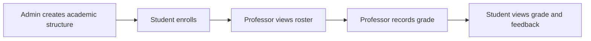
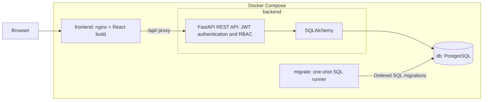
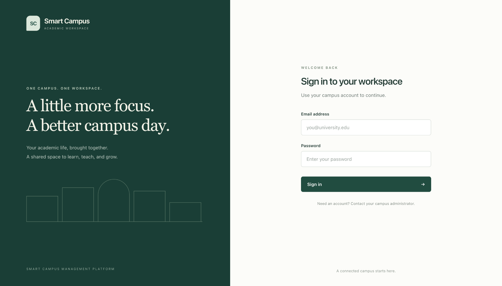
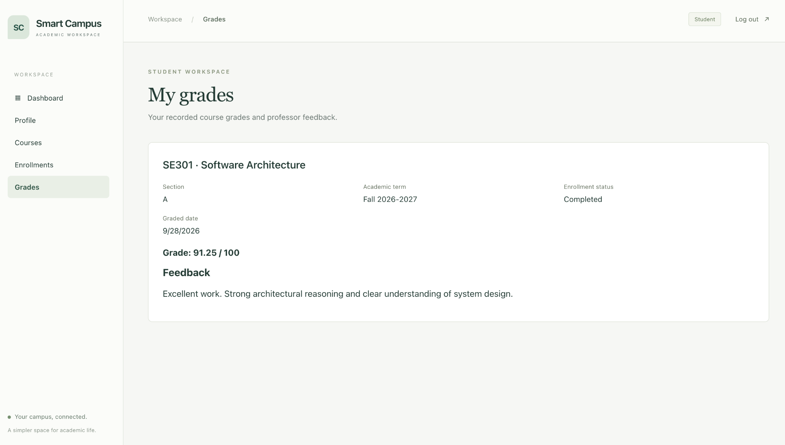
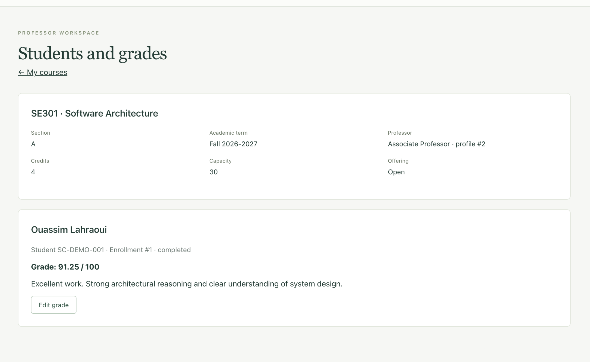
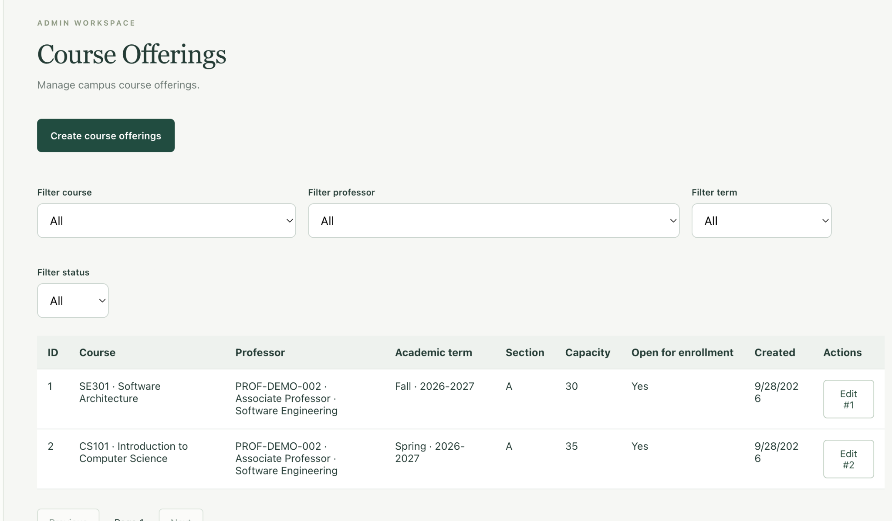

# Smart Campus Management Platform

A full-stack academic management platform with role-based workflows for students,
professors, and administrators. Built as a software engineering portfolio project
using FastAPI, PostgreSQL, and React.

## Overview

Smart Campus connects academic administration, enrollment, teaching, and grading
in one application. Administrators define the academic structure, students enroll
in course offerings, and assigned professors manage rosters and grades.

## Key Features

- JWT authentication and API-enforced role-based authorization.
- PostgreSQL relational model and a documented REST API.
- Responsive React interface with role-aware navigation and protected routes.
- Docker Compose environment with nginx, database persistence, and SQL migrations.
- Automated backend tests covering authentication, authorization, and academic workflows.

## Role-Based Workflows

| Role | Capabilities |
| --- | --- |
| Student | Manage academic profile; browse courses and offerings; enroll or drop; view enrollment history, grades, and professor feedback. |
| Professor | Manage professor profile; view assigned offerings and student rosters; create and update numeric grades and feedback. |
| Administrator | Manage users, departments, courses, academic terms, and course offerings. |

Grades are recorded on a 0–100 scale. Recording a grade completes the enrollment.
User, department, and course deactivation retains the underlying records; the
current department and course lists show active records only.



## Architecture



Routers handle HTTP requests, services implement business operations, Pydantic
schemas validate inputs and responses, and SQLAlchemy manages persistence.
The frontend separates API services, authentication state, route guards, and
pages. nginx serves the production build and supports direct React Router links.

Startup order: **database healthy → migrations successful → backend healthy → frontend**.

## Tech Stack

| Area | Technologies |
| --- | --- |
| Backend | Python, FastAPI, Pydantic, SQLAlchemy 2.x, psycopg |
| Database | PostgreSQL 17, ordered SQL migrations |
| Authentication | JWT, Argon2 password hashing, role-based authorization |
| Frontend | React, TypeScript, Vite, React Router, Axios, CSS |
| Runtime | Docker Compose, nginx |
| Testing | pytest; SQLite in-memory databases for automated backend tests |

## Project Structure

```text
backend/
├── app/                 # API routers, services, models, schemas, configuration
├── migrations/          # Ordered PostgreSQL SQL migrations
├── scripts/             # Docker migration runner
├── tests/               # Backend test suite
├── Dockerfile
└── requirements.txt
frontend/
├── src/                 # Pages, components, services, hooks, routes, types
├── Dockerfile
├── nginx.conf
└── package.json
docs/
└── screenshots/         # Reserved for application screenshots
compose.yaml
.env.example
```

## Getting Started with Docker

Prerequisites: Git, Docker with Compose, and Python 3 to generate a secret.

```sh
git clone https://github.com/OuassimLh-dev/smart-campus-platform.git
cd smart-campus-platform
cp .env.example .env
python3 -c 'import secrets; print(secrets.token_urlsafe(32))'
```

Paste the generated value into `JWT_SECRET_KEY` in `.env` (at least 32 characters).
Do not commit this file. Then start the stack:

```sh
docker compose config --quiet
docker compose up --build -d --wait
docker compose ps
```

Open [Smart Campus](http://localhost:8080). The backend is available on port 8000.
Both published ports bind to loopback. PostgreSQL is internal to the stack and
uses the persistent `campus_postgres` volume, separate from host PostgreSQL data.

Compose supplies the container database URL. The optional `POSTGRES_PASSWORD`
uses a local-development default; set it before first startup to override it,
using URL-safe characters. No default JWT secret is supplied.

A fresh database contains no accounts or academic data. Student accounts can be
registered through the API documentation; there is no registration UI or seeded
demo login. Professor and administrator access requires an appropriately
provisioned account. The admin user-creation API does not assign a password.

Stop the stack while retaining data:

```sh
docker compose down
```

**Warning: the following command deletes the Docker database volume and its data.**

```sh
docker compose down -v
```

## Local Development

Prerequisites: Python 3.13 (used by the backend Docker image), PostgreSQL with
`psql`, and Node.js 22.12 or newer with npm. Commands below use a POSIX shell.
Stop the Docker stack first if its backend occupies port 8000.

Create a PostgreSQL database and login role, then create the root `.env` from
[.env.example](.env.example) if it does not exist. Set `DATABASE_URL` to your local
connection, generate `JWT_SECRET_KEY` as above, and retain `JWT_ALGORITHM=HS256`.
`ACCESS_TOKEN_EXPIRE_MINUTES` controls access-token lifetime.

For a **fresh local database only**, apply the SQL files in order. Set libpq
connection variables for your database; `psql` prompts for its password:

```sh
export PGHOST=localhost PGPORT=5432 PGUSER=campus_user PGDATABASE=smart_campus
for migration in backend/migrations/*.sql; do
  psql -X -v ON_ERROR_STOP=1 -f "$migration" || break
done
```

This manual bootstrap does not create Docker's migration tracking records. Do not
rerun it against an initialized database; apply only pending files when maintaining
a local database. Docker is the primary path for automatic tracked migrations.

Start the backend from the repository root:

```sh
cd backend
python3 -m venv .venv
source .venv/bin/activate
python -m pip install -r requirements.txt
uvicorn app.main:app --reload --host 127.0.0.1 --port 8000
```

In another terminal, from the repository root:

```sh
cd frontend
cp .env.example .env
npm install
npm run dev
```

The frontend example sets `VITE_API_BASE_URL=http://127.0.0.1:8000/api/v1`.
Open [the Vite frontend](http://localhost:5173). Local CORS permits only
`http://localhost:5173` and `http://127.0.0.1:5173`. In Docker, the frontend uses
same-origin `/api/v1` requests through nginx instead.

## Database Migrations

The one-shot `migrate` service mounts [backend/migrations](backend/migrations)
read-only and applies SQL files in filename order. It uses `psql` with
`ON_ERROR_STOP=1`; each migration retains its own `BEGIN`/`COMMIT` transaction.
Successful filenames are recorded in `public.schema_migrations` and skipped on
future runs. A session advisory lock serializes concurrent migration runners.
A failure prevents initial backend startup.

Do not modify previously applied migrations. Add a new ordered migration for a
schema change. Existing databases created outside this runner are not
automatically marked as migrated. If execution is interrupted between a file's
COMMIT and its tracking insert, inspect the schema and tracking table before
retrying. There is no automatic rollback or migration-baselining tool.

## Testing

From the repository root, with backend dependencies installed:

```sh
cd backend
source .venv/bin/activate
python -m pytest
```

The current backend suite contains **288 tests** and uses isolated SQLite
in-memory databases; it does not require a running PostgreSQL instance.

From the repository root, with frontend dependencies installed:

```sh
cd frontend
npm run typecheck
npm run build
```

The production build includes TypeScript compilation. It is a build check, not
an automated browser test suite. Validate Compose configuration from the root:

```sh
docker compose config --quiet
```

## Continuous Integration

[GitHub Actions CI](.github/workflows/ci.yml) runs on pushes to `main` and pull
requests targeting `main`. Independent jobs run the backend pytest suite,
frontend TypeScript checks and production build, and Docker Compose validation,
image builds, and integration startup. Docker checks verify both health endpoints
and the `/grades` SPA route, then always tear down the stack and its volumes.
CI uses disposable test configuration and read-only repository permissions.
Newer runs for the same ref cancel older in-progress runs.

## Deployment: Railway

Deployment support is prepared; this repository does not imply a live Railway
deployment. Use three services in the same Railway project/environment:
`frontend`, `backend`, and `Postgres`. Only `frontend` needs a public domain.
Keep backend networking private and do not enable a public PostgreSQL TCP proxy.
The browser calls same-origin `/api/v1`; nginx alone resolves the private backend.

New Railway services must configure these settings manually in the service
dashboard. Connect this repository separately for each application service:

| Setting | Backend | Frontend |
| --- | --- | --- |
| Root directory | `/backend` | `/frontend` |
| Build | Detected `Dockerfile` | Detected `Dockerfile` |
| Public domain | None (private service) | Enabled |
| Pre-deploy command | `sh /app/scripts/migrate.sh` | None |
| Healthcheck path | `/api/v1/health` | `/api/v1/health` (through backend) |
| Healthcheck timeout | Dashboard default or 180–300 seconds | Dashboard default or 180–300 seconds |
| Restart policy | Optional dashboard setting | Optional dashboard setting |

Leave start-command overrides empty to use the Docker image commands. Set the
backend's `PORT=8000` explicitly so the frontend can reference it. The backend
honors any `PORT` override, defaulting to 8000 locally. New Railway environments support private IPv4, so the default bind address
`0.0.0.0` works. For a legacy IPv6-only environment, set `BIND_HOST=::`.
The frontend listens on Railway's `PORT` (default 80 in the image), on both IPv4
and IPv6. Set the frontend public domain's target port to that value.

Legacy Config as Code is deprecated and unavailable to new services. This
setup uses dashboard settings only. See the
[monorepo guide](https://docs.railway.com/deployments/monorepo).

Backend variables (replace service names in references if yours differ):

| Variable | Value / Railway reference |
| --- | --- |
| `DATABASE_URL` | `${{Postgres.DATABASE_URL}}` (private PostgreSQL URL) |
| `PGHOST` | `${{Postgres.PGHOST}}` (must be the private host) |
| `PGPORT` | `${{Postgres.PGPORT}}` |
| `PGUSER` | `${{Postgres.PGUSER}}` |
| `PGPASSWORD` | `${{Postgres.PGPASSWORD}}` |
| `PGDATABASE` | `${{Postgres.PGDATABASE}}` |
| `JWT_SECRET_KEY` | Generate a unique random secret of at least 32 characters |
| `JWT_ALGORITHM` | `HS256` |
| `ACCESS_TOKEN_EXPIRE_MINUTES` | `30` (or another positive integer) |
| `PORT` | `8000` (explicit referenceable backend port) |
| `BIND_HOST` | Optional; default `0.0.0.0`, use `::` for legacy IPv6-only networks |

The application accepts `postgresql://` and `postgresql+psycopg://`; its engine
normalizes either to the psycopg driver. Referencing the database's standard URL
avoids manually rebuilding or incorrectly escaping credentials. Do not use its
public URL. The migration runner **does not read DATABASE_URL**: `psql` uses the
separate standard `PG*` variables, with a 15-second connection timeout and no
interactive password prompt.

Frontend variables:

| Variable | Value / Railway reference |
| --- | --- |
| `BACKEND_HOST` | `${{backend.RAILWAY_PRIVATE_DOMAIN}}` |
| `BACKEND_PORT` | `${{backend.PORT}}` |
| `PORT` | Provided by Railway; no manual value required |

Do not put the private hostname in `VITE_API_BASE_URL`; the Docker build keeps
that value at `/api/v1`. nginx templates substitute only the deployment variables
and the container DNS resolver list. nginx runtime variables remain intact, and
backend DNS is refreshed to follow redeployments. Local defaults remain
`BACKEND_HOST=backend`, `BACKEND_PORT=8000`, and frontend `PORT=80`.

The backend image bundles `psql`, the unchanged SQL files, and the same migration
runner used by Compose. Railway's pre-deploy command applies pending migrations
and stops deployment on failure; recorded migrations are skipped. Set a suitable
pre-deploy timeout in the dashboard (for example 300 seconds). The migration
recovery limitation described above still applies. Deploy PostgreSQL first, then
the backend, then the frontend, because its healthcheck also checks backend
reachability. Railway does not use Compose dependency ordering.

Use Railway reference variables instead of copying database credentials. Review
the resolved private hosts, pre-deploy result, healthchecks, and public frontend
routing when deploying manually. No Railway token or GitHub Actions deployment
step is needed. See [private networking](https://docs.railway.com/networking/private-networking)
and [pre-deploy commands](https://docs.railway.com/deployments/pre-deploy-command).

## Browser E2E tests

Playwright verifies real login, role navigation, route protection, and basic page
loading through the Docker nginx frontend at `http://localhost:8080`. Chromium
is the only browser. No APIs are mocked.

From the repository root (Node 22.12+ and Docker Compose 2.24.4+):

```bash
npm ci --prefix frontend
(cd frontend && npx playwright install --with-deps chromium)
sh scripts/e2e.sh
```

Port 8080 must be free. If your development stack is running, stop its frontend
with `docker compose stop frontend` first; restart it afterward with
`docker compose start frontend`. The E2E runner does not stop it for you.

Each run creates a uniquely named Compose project and fresh PostgreSQL volume,
uses fake test secrets without reading `.env`, applies the existing migrations,
and seeds three fake accounts with hashed passwords plus a professor profile.
The seed refuses non-E2E databases and nonempty user tables. It adds no production endpoint or behavior.
The runner always removes **only its own disposable containers and volume** on
exit, including test failures. No developer database reset is needed.

`npm --prefix frontend run test:e2e` runs only the browser tests against an
already prepared stack; it never resets data. To inspect the disposable stack
interactively, use `sh scripts/e2e.sh --ui` (close the UI to clean up).
Reports, failure screenshots, and traces are ignored by Git and excluded from
the frontend image. View the last report with
`(cd frontend && npx playwright show-report)`. CI runs this suite in a separate
job and uploads artifacts only on failure. The suite covers authentication and
role protection, plus one UI-only academic workflow: admin academic setup, student profile creation and enrollment, professor
grading, and student grade visibility. This stateful scenario has retries disabled
to avoid reusing partially created records; each runner invocation starts fresh.

## API Documentation

With the backend running:

- [Swagger UI](http://localhost:8000/docs)
- [OpenAPI schema](http://localhost:8000/openapi.json)
- Health endpoint: `GET /api/v1/health` → `{"status":"ok"}`

Health is also available [through nginx](http://localhost:8080/api/v1/health).
The health endpoint reports API availability, not a database readiness check.

## Security / Authentication

Passwords are hashed with Argon2; API responses exclude password hashes.
Login returns an expiring JWT access token, and API dependencies enforce the
current user's active status, role, and resource ownership. Frontend route guards
support navigation but do not replace backend authorization.

The portfolio frontend stores its token in `sessionStorage`, which is accessible
to JavaScript. Public registration is limited to students. Secrets are loaded
from environment configuration and excluded from image build contexts. Refresh
tokens, password reset, email verification, and OAuth are outside the current scope.

## Screenshots

### Login



### Student Grades



### Professor Roster and Grading



### Admin Course Offering Management



## Current Scope / Future Improvements

The implemented scope covers role-based academic administration, enrollment,
and grading. It is a portfolio application, not a production deployment.
Potential next steps include frontend integration tests, PostgreSQL integration
tests, stronger migration recovery, account provisioning, and deployment
hardening. Attendance, assignments, messaging, notifications, GPA calculations,
and transcripts are not implemented.

## Author

Ouassim Lahraoui — Software Engineering Student
